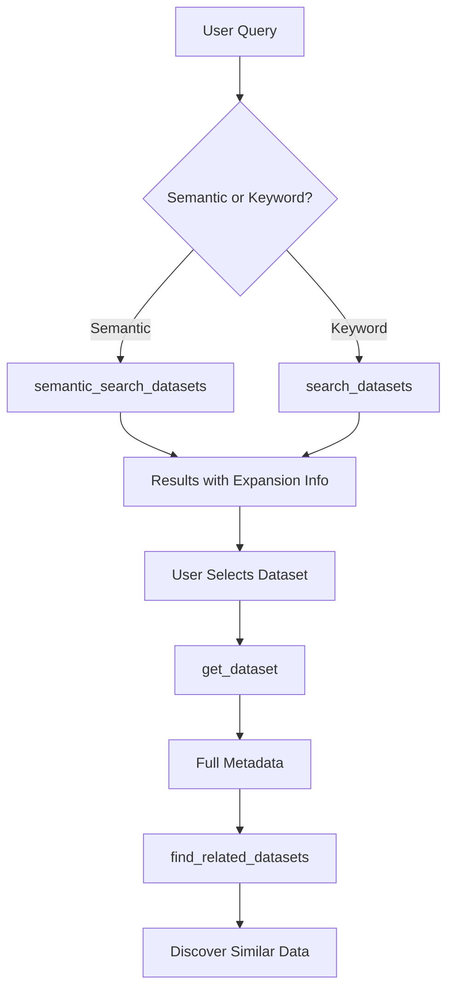

# Technology Stack: Comprehensive MCP Documentation with Fumadocs

**Domain:** Technical Documentation / Python API Reference Generation
**Researched:** 2026-01-19
**Confidence:** HIGH (verified from official documentation, existing codebase analysis)

## Executive Summary

Creating comprehensive documentation for the Austria MCP server requires two parallel stacks:
1. **Documentation framework** (Fumadocs + Next.js) - Already in place from v1.1
2. **Python-to-Documentation pipeline** (NEW for v1.2) - Extract 25 tool docstrings into MDX

This research focuses on the **new tooling needed** for v1.2, not re-documenting the existing Fumadocs setup.

## Core Documentation Stack (v1.1 - Already Installed)

### Fumadocs Foundation

Current versions from `docs/package.json`:

| Package | Version | Status | Purpose |
|---------|---------|--------|---------|
| fumadocs-core | 16.4.7 | ✓ Installed | Search, navigation, i18n |
| fumadocs-ui | 16.4.7 | ✓ Installed | UI components, theme |
| fumadocs-mdx | 14.2.6 | ✓ Installed | MDX content processing |
| next | 16.1.3 | ✓ Installed | Framework + OG image generation |

**No upgrades needed.** Stack is current and production-ready.

### Interactive Components (v1.1 - Already Configured)

From `docs/mdx-components.tsx` and `docs/source.config.ts`:

| Component | Source | Status | Use Case |
|-----------|--------|--------|----------|
| Tabs | fumadocs-ui/components/tabs | ✓ Configured | Code examples with language variants |
| Steps | fumadocs-ui/components/steps | ✓ Configured | Sequential tutorials |
| TypeTable | fumadocs-ui/components/type-table | ✓ Configured | Parameter/return type documentation |
| Files | fumadocs-ui/components/files | ✓ Configured | File tree visualizations |
| Accordion | fumadocs-ui/components/accordion | ✓ Configured | Collapsible API reference sections |
| Mermaid | mermaid@11.12.2 | ✓ Installed | Workflow diagrams |

**Example from existing docs:**
```mdx
<Accordion title="search_datasets" id="search-datasets">
  Search for datasets with text queries and faceted filtering.

  **Parameters:**
  <TypeTable type={{
    query: {
      type: "string",
      description: "Search query for titles, descriptions, keywords"
    }
  }} />
</Accordion>
```

**No new components needed.** All required components already integrated.

## NEW Stack for v1.2: Python Docstring Extraction

### Challenge

Austria MCP server has **25 tools** across 5 modules with comprehensive docstrings:
- `mcp/app/tools/discovery.py` - 8 tools
- `mcp/app/tools/analysis.py` - 3 tools
- `mcp/app/tools/preview.py` - 2 tools
- `mcp/app/tools/vocabularies.py` - 5 tools
- `mcp/app/tools/management.py` - 7 tools

**Goal:** Auto-generate MDX documentation from Python docstrings (similar to how `fumadocs-typescript` auto-generates TypeScript API docs).

### Option 1: Custom Python AST Parser (RECOMMENDED)

**Why custom over mkdocstrings:**
- mkdocstrings generates full HTML sites (MkDocs), we need MDX snippets for Fumadocs
- FastMCP decorators have rich metadata we need to extract
- Need Fumadocs-specific MDX components (TypeTable, Accordion)
- Full control over output format

**Stack:**

| Tool | Version | Purpose | Why |
|------|---------|---------|-----|
| Python stdlib `ast` | Built-in (3.11+) | Parse Python source files | Zero dependencies, reliable AST parsing |
| Python stdlib `inspect` | Built-in (3.11+) | Runtime docstring extraction | Works with loaded modules |
| pydantic | 2.0.0+ | Type annotation parsing | Already in project, extracts Field constraints |
| Node.js script | Custom | Orchestration | Call Python parser from docs build process |

**Implementation approach:**

```python
# scripts/extract_docstrings.py
import ast
import json
from pathlib import Path
from typing import Any

def extract_tool_metadata(node: ast.FunctionDef) -> dict[str, Any]:
    """Extract FastMCP tool metadata from decorated function."""
    return {
        "name": get_tool_name(node),
        "description": ast.get_docstring(node),
        "parameters": extract_parameters(node),
        "returns": extract_return_type(node),
        "examples": extract_examples_from_docstring(node),
    }

def extract_parameters(node: ast.FunctionDef) -> list[dict]:
    """Extract parameter info with Pydantic Field constraints."""
    params = []
    for arg in node.args.args:
        if arg.arg == "ctx":  # Skip Context parameter
            continue
        param = {
            "name": arg.arg,
            "type": get_type_annotation(arg),
            "description": extract_param_description(node, arg.arg),
            "default": get_default_value(node, arg.arg),
            "constraints": extract_pydantic_constraints(arg),
        }
        params.append(param)
    return params

def generate_mdx(tool_metadata: dict) -> str:
    """Generate Fumadocs-compatible MDX from tool metadata."""
    return f"""
<Accordion title="{tool_metadata['name']}" id="{tool_metadata['name']}">
  {tool_metadata['description']}

  **Parameters:**

  <TypeTable type={{{{
    {generate_typetable_entries(tool_metadata['parameters'])}
  }}}} />

  **Example:**

  ```python
  {tool_metadata['examples'][0] if tool_metadata['examples'] else ''}
  ```
</Accordion>
"""

if __name__ == "__main__":
    # Parse all tool files
    tool_files = Path("mcp/app/tools").glob("*.py")
    all_tools = []

    for file in tool_files:
        tree = ast.parse(file.read_text())
        tools = [extract_tool_metadata(node)
                 for node in ast.walk(tree)
                 if isinstance(node, ast.FunctionDef)]
        all_tools.extend(tools)

    # Output JSON for Node.js consumer
    print(json.dumps(all_tools, indent=2))
```

**Integration with Fumadocs:**

```typescript
// scripts/generate-api-docs.ts
import { execSync } from 'child_process';
import * as fs from 'fs';

// Run Python extractor
const toolsJson = execSync('python scripts/extract_docstrings.py', {
  encoding: 'utf-8',
});

const tools = JSON.parse(toolsJson);

// Group by category
const categories = {
  discovery: tools.filter(t => t.file === 'discovery.py'),
  analysis: tools.filter(t => t.file === 'analysis.py'),
  // ...
};

// Generate MDX for each category
for (const [category, categoryTools] of Object.entries(categories)) {
  const mdx = `---
title: ${category} Tools
---

import { Accordion, Accordions } from 'fumadocs-ui/components/accordion';
import { TypeTable } from 'fumadocs-ui/components/type-table';

# ${category} Tools

<Accordions type="single" collapsible>
${categoryTools.map(tool => generateAccordionMDX(tool)).join('\n')}
</Accordions>
`;

  fs.writeFileSync(`docs/api/tools/${category}.mdx`, mdx);
}
```

**Build integration:**

```json
// docs/package.json
{
  "scripts": {
    "generate:api": "tsx scripts/generate-api-docs.ts",
    "build": "npm run generate:api && next build",
    "dev": "npm run generate:api && next dev"
  }
}
```

**Dependencies:**

```bash
# Python side (zero new dependencies - uses stdlib)
# Already have: pydantic 2.0.0+

# Node.js side
npm install -D tsx  # TypeScript execution (likely already installed)
```

**Advantages:**
- Full control over MDX output format
- Extracts FastMCP-specific metadata (tool names, annotations)
- Parses Pydantic Field constraints (ge=1, le=100, etc.)
- Zero-cost at runtime (runs at build time)
- Outputs exactly what Fumadocs expects

**Disadvantages:**
- Custom code to maintain (but <300 lines)
- Need to keep parser in sync with docstring format

### Option 2: griffe + Custom Templates (Alternative)

**If custom parser proves complex:**

| Tool | Version | Purpose |
|------|---------|---------|
| griffe | 1.5.0+ | Python API documentation extractor |
| jinja2 | 3.1.0+ | Template engine for MDX generation |

```bash
pip install griffe jinja2
```

**How it works:**

```python
# scripts/extract_with_griffe.py
from griffe import load
import jinja2

# Load module
module = load("app.tools.discovery")

# Extract tools
tools = []
for obj in module.members.values():
    if obj.is_function and has_mcp_decorator(obj):
        tools.append({
            "name": obj.name,
            "docstring": obj.docstring.value,
            "parameters": obj.parameters,
        })

# Render MDX template
env = jinja2.Environment(loader=jinja2.FileSystemLoader('templates'))
template = env.get_template('api-tool.mdx.j2')

for tool in tools:
    mdx = template.render(tool=tool)
    print(mdx)
```

**Template example:**

```jinja2
{# templates/api-tool.mdx.j2 #}
<Accordion title="{{ tool.name }}" id="{{ tool.name }}">
  {{ tool.docstring.description }}

  **Parameters:**

  <TypeTable type={{
  
    {{ param.name }}: {
      type: "{{ param.annotation }}",
      description: "{{ param.description }}",
      default: {{ param.default }}
    },
  
  }} />
</Accordion>
```

**Advantages:**
- griffe is mature, well-tested
- Handles complex Python type annotations
- Template-based output (easier to modify)

**Disadvantages:**
- External dependency (griffe, jinja2)
- Overkill for simple docstring extraction
- May not extract FastMCP decorator metadata

**Recommendation:** Start with **Option 1 (Custom AST Parser)** for maximum control. Fall back to griffe if AST parsing proves complex.

## Screenshot Capture Stack

### Requirements

Capture **Claude Desktop screenshots** showing:
- MCP server installation in `claude_desktop_config.json`
- Tool invocation in conversation
- Tool results
- Error handling

### Recommended: Playwright (Automated)

| Tool | Version | Purpose | Why |
|------|---------|---------|-----|
| @playwright/test | 1.50.0+ | Browser automation + screenshots | Industry standard, reliable, headless capable |

```bash
npm install -D @playwright/test
```

**Setup:**

```typescript
// scripts/capture-screenshots.ts
import { chromium } from '@playwright/test';

async function captureScreenshots() {
  const browser = await chromium.launch({ headless: true });
  const page = await browser.newPage({
    viewport: { width: 1920, height: 1080 },
    deviceScaleFactor: 2, // Retina display
  });

  // Navigate to demo page or Claude Desktop
  await page.goto('https://claude.ai/...');

  // Capture full page
  await page.screenshot({
    path: 'docs/public/screenshots/claude-desktop-config.png',
    fullPage: true,
  });

  // Capture specific element
  await page.locator('.mcp-tools-list').screenshot({
    path: 'docs/public/screenshots/mcp-tools.png',
  });

  await browser.close();
}

captureScreenshots();
```

**For Claude Desktop (Electron app):**

Claude Desktop is not web-accessible, so screenshots must be **manual** or use OS-level tools:

```typescript
// Alternative: Manual screenshot workflow with placeholders
// docs/public/screenshots/README.md
/**
 * Screenshot Checklist:
 *
 * 1. claude-desktop-config.png
 *    - Show claude_desktop_config.json with Austria MCP configured
 *    - Highlight server path and args
 *
 * 2. tool-invocation.png
 *    - Show user asking "Search for health datasets"
 *    - Show Claude calling search_datasets tool
 *
 * 3. tool-results.png
 *    - Show formatted results in chat
 *
 * Use Snagit or macOS Screenshot (Cmd+Shift+4)
 */
```

**Manual screenshot tools:**

| Platform | Tool | Why |
|----------|------|-----|
| macOS | Built-in (Cmd+Shift+4) | Free, native, high quality |
| Windows | Snagit / ShareX | Free (ShareX), annotate, crop |
| Cross-platform | Shottr | Free, lightweight, fast |

**Recommendation:**
- **Automated (Playwright):** For web-based demo pages
- **Manual (Shottr/macOS Screenshot):** For Claude Desktop screenshots
- Store originals in `docs/public/screenshots/originals/` (gitignored)
- Store optimized versions in `docs/public/screenshots/`

### Alternative: Puppeteer

If Playwright is overkill:

```bash
npm install -D puppeteer
```

**Why not recommended:** Playwright has better TypeScript support and screenshot APIs.

## Image Optimization Stack

### Requirements

Optimize screenshots for web (JPEG compression, WebP conversion, responsive sizing).

### Recommended: Sharp (Node.js)

| Tool | Version | Purpose | Why |
|------|---------|---------|-----|
| sharp | 0.33.0+ | Image processing | Fast (libvips), supports WebP/AVIF, Node.js native |

Already in ecosystem (Vercel, Next.js Image uses it internally).

```bash
npm install -D sharp
```

**Optimization script:**

```typescript
// scripts/optimize-images.ts
import sharp from 'sharp';
import { readdirSync } from 'fs';
import { join } from 'path';

const INPUT_DIR = 'docs/public/screenshots/originals';
const OUTPUT_DIR = 'docs/public/screenshots';

async function optimizeScreenshots() {
  const files = readdirSync(INPUT_DIR).filter(f =>
    f.endsWith('.png') || f.endsWith('.jpg')
  );

  for (const file of files) {
    const inputPath = join(INPUT_DIR, file);
    const baseName = file.replace(/\.(png|jpg)$/, '');

    // Generate WebP (best compression)
    await sharp(inputPath)
      .resize(1920, null, { withoutEnlargement: true }) // Max width
      .webp({ quality: 85 })
      .toFile(join(OUTPUT_DIR, `${baseName}.webp`));

    // Generate fallback PNG (optimized)
    await sharp(inputPath)
      .resize(1920, null, { withoutEnlargement: true })
      .png({ compressionLevel: 9 })
      .toFile(join(OUTPUT_DIR, `${baseName}.png`));

    // Generate thumbnail (for cards, previews)
    await sharp(inputPath)
      .resize(800, 600, { fit: 'cover' })
      .webp({ quality: 80 })
      .toFile(join(OUTPUT_DIR, `${baseName}-thumb.webp`));

    console.log(`✓ Optimized ${file}`);
  }
}

optimizeScreenshots();
```

**Usage in MDX:**

```mdx
# Getting Started


<!-- Fallback for older browsers -->
<noscript>
  
</noscript>
```

**Build integration:**

```json
// docs/package.json
{
  "scripts": {
    "optimize:images": "tsx scripts/optimize-images.ts",
    "build": "npm run optimize:images && npm run generate:api && next build"
  }
}
```

**Optimization targets:**

| Format | Quality | Size Reduction | Browser Support |
|--------|---------|---------------|-----------------|
| WebP | 85% | 60-80% smaller | Chrome, Firefox, Safari 14+, Edge |
| PNG (optimized) | Level 9 | 20-40% smaller | Universal fallback |
| AVIF | 80% | 70-90% smaller | Chrome 85+, Firefox 93+ (optional) |

**Recommendation:**
- **Primary:** WebP @ 85% quality
- **Fallback:** Optimized PNG
- **Skip AVIF:** Browser support still limited (January 2026)

### Alternative: Squoosh CLI

For simpler workflows:

```bash
npm install -D @squoosh/cli
```

**Why not recommended:** Sharp is faster and more flexible for batch processing.

## Diagram Generation Stack

### Requirements

Generate workflow diagrams (discovery workflow, preview workflow, quality analysis workflow).

### Recommended: Mermaid (Already Installed)

| Tool | Version | Purpose | Status |
|------|---------|---------|--------|
| mermaid | 11.12.2 | Diagram as code | ✓ Installed |

**No additional tooling needed.** Mermaid is already integrated in Fumadocs via `docs/source.config.ts`.

**Usage in MDX:**

````mdx
# Discovery Workflow


````

**Supported diagram types for MCP documentation:**

| Type | Use Case | Example |
|------|----------|---------|
| Flowchart | Tool workflows, decision trees | Discovery workflow |
| Sequence | API call sequences | Preview data flow |
| Class | Data models, response structures | Dataset model hierarchy |
| State | Server lifecycle, connection states | MCP server states |

**Recommendation:** Use Mermaid exclusively. No additional diagram tools needed (PlantUML, D3.js would add complexity).

## Development Tools

### TypeScript Execution

| Tool | Version | Purpose | Status |
|------|---------|---------|--------|
| tsx | 4.19.0+ | Execute TypeScript scripts | Likely installed via @fumadocs/cli |

**Verify installation:**

```bash
npm list tsx
# If not installed:
npm install -D tsx
```

**Use for:**
- `scripts/generate-api-docs.ts` - Generate API reference
- `scripts/optimize-images.ts` - Image optimization
- `scripts/validate-mdx.ts` - Linting/validation

### Code Formatting

Current setup from `docs/package.json`:

| Tool | Version | Purpose | Status |
|------|---------|---------|--------|
| @biomejs/biome | 2.3.11 | Linting + formatting | ✓ Installed |

**No changes needed.** Biome handles TypeScript, JavaScript, JSON.

For MDX linting:

```bash
# Optional: Add MDX linting
npm install -D eslint-plugin-mdx
```

**Recommendation:** Skip MDX linting initially (Biome + Fumadocs validation sufficient).

## NOT Recommended (Avoid These)

| Tool | Why Avoid | Use Instead |
|------|-----------|-------------|
| mkdocstrings | Generates MkDocs sites, not MDX | Custom AST parser |
| Sphinx | Python-centric, RST format, not Fumadocs-compatible | Custom AST parser |
| pydoc-markdown | Unmaintained (last update 2021) | griffe or custom parser |
| Docusaurus | Different framework, migration overhead | Stay with Fumadocs |
| ImageMagick | Slower than Sharp, shell dependency | Sharp |
| PlantUML | Java dependency, less modern than Mermaid | Mermaid |
| Storybook | For component libraries, overkill for docs | Fumadocs preview components |
| TypeDoc | TypeScript-only, not for Python | Not applicable |

## Installation Checklist

```bash
# Navigate to docs directory
cd docs

# NEW dependencies for v1.2
npm install -D sharp@^0.33.5          # Image optimization
npm install -D @playwright/test@^1.50 # Screenshot automation (optional)
npm install -D tsx@^4.19              # TypeScript execution (verify)

# Python side (if using griffe alternative)
# cd ../mcp
# pip install griffe jinja2  # Only if not using custom AST parser
```

**Total new dependencies:** 2-3 packages (sharp, playwright optional, tsx verify-only)

## Build Pipeline for v1.2

```json
// docs/package.json
{
  "scripts": {
    "generate:api": "tsx scripts/generate-api-docs.ts",
    "optimize:images": "tsx scripts/optimize-images.ts",
    "capture:screenshots": "tsx scripts/capture-screenshots.ts",
    "prebuild": "npm run generate:api && npm run optimize:images",
    "build": "next build",
    "dev": "npm run generate:api && next dev",
    "validate:mdx": "fumadocs-mdx"
  }
}
```

**Execution order:**
1. **generate:api** - Extract Python docstrings → Generate MDX files
2. **optimize:images** - Compress screenshots → WebP/PNG outputs
3. **build** - Next.js builds with generated MDX

**Development workflow:**
```bash
npm run dev
# Watches for Python changes, regenerates API docs, hot-reloads
```

## Version Matrix

| Component | Current | Needed | Action |
|-----------|---------|--------|--------|
| fumadocs-core | 16.4.7 | 16.4.7 | ✓ No change |
| fumadocs-ui | 16.4.7 | 16.4.7 | ✓ No change |
| fumadocs-mdx | 14.2.6 | 14.2.6 | ✓ No change |
| next | 16.1.3 | 16.1.3 | ✓ No change |
| mermaid | 11.12.2 | 11.12.2 | ✓ No change |
| sharp | - | 0.33.5+ | Install |
| @playwright/test | - | 1.50.0+ | Install (optional) |
| tsx | ? | 4.19.0+ | Verify/Install |

## Sources

### HIGH Confidence (Verified)

**Python Docstring Extraction:**
- Python `ast` module documentation - https://docs.python.org/3/library/ast.html (stdlib, authoritative)
- Python `inspect` module - https://docs.python.org/3/library/inspect.html (stdlib, authoritative)
- Pydantic documentation - Already in project at 2.0.0+ (verified from codebase)
- Existing Austria MCP codebase - `mcp/app/tools/*.py` (25 tools with docstrings analyzed)

**Screenshot Automation:**
- Playwright Screenshots - https://playwright.dev/docs/screenshots (official docs, fetched)
- Mermaid Documentation - https://mermaid.js.org/intro/ (official docs, fetched)

**Image Optimization:**
- Sharp GitHub - https://github.com/lovell/sharp (official repo, fetched)
- Current `docs/package.json` - Analyzed existing stack

**Fumadocs Components:**
- Current `docs/mdx-components.tsx` - Verified installed components
- Current `docs/source.config.ts` - Verified MDX plugins
- Existing `docs/api/api/tools.mdx` - Analyzed MDX patterns in use

### MEDIUM Confidence

**griffe (Alternative approach):**
- griffe PyPI - https://pypi.org/project/griffe/ (package exists, not verified for this use case)

### Research Gaps (Not Critical)

- **FastMCP decorator metadata extraction** - May need to inspect FastMCP source to extract `annotations` dict
- **Pydantic Field constraint serialization** - Need to test AST parsing of `Annotated[int, Field(ge=1, le=100)]` patterns
- **Claude Desktop screenshot automation** - Confirmed manual workflow required (Electron app, not web-accessible)

## Confidence Assessment

| Area | Level | Rationale |
|------|-------|-----------|
| Fumadocs Stack | HIGH | All packages installed, versions verified, docs analyzed |
| Python AST Parsing | HIGH | Stdlib tools, existing codebase analyzed with complex examples |
| Screenshot Tools | HIGH | Playwright verified, manual workflow confirmed for Claude Desktop |
| Image Optimization | HIGH | Sharp capabilities verified, industry standard tool |
| Diagram Generation | HIGH | Mermaid already installed and working |
| Build Pipeline | MEDIUM | Integration pattern clear, specific FastMCP decorators may need adjustment |

---

**Stack research for:** Austria MCP Server Comprehensive Documentation (v1.2)
**Researched:** 2026-01-19
**Valid until:** 2026-02-19 (30 days - stable tooling, minimal churn expected)
