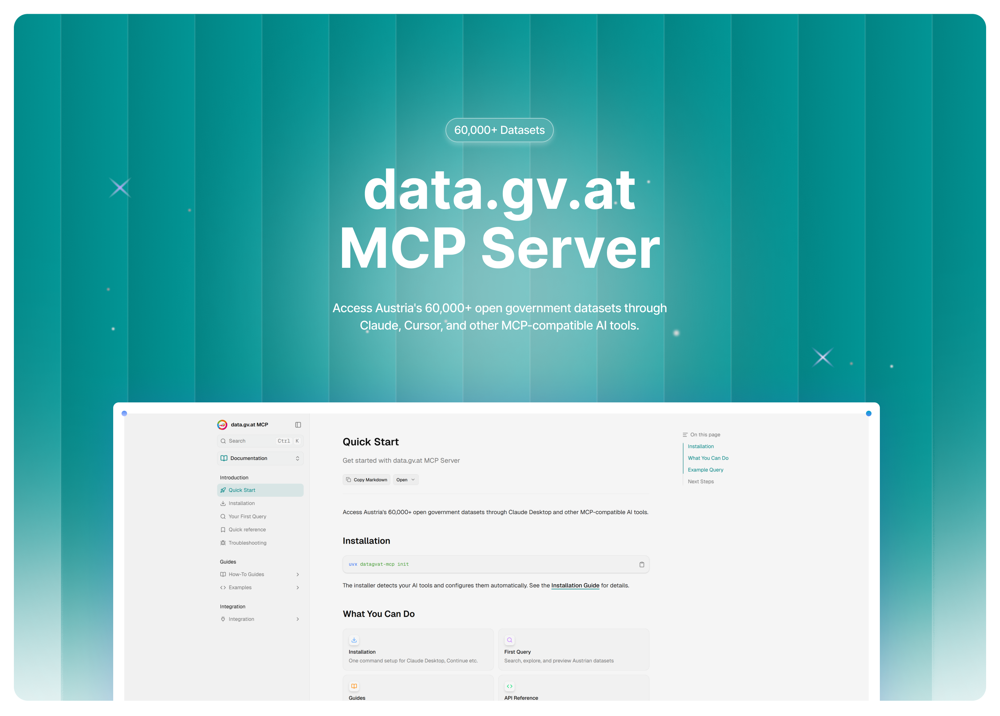

<h1 align="center">data.gv.at MCP Server</h1>

<p align="center" style="width:80%;margin:0 auto;">
  <a href="https://mcp.julianschmidt.cv">
    
  </a>
</p>

<p align="center" style="margin-top: 1em;">
  <a href="LICENSE">
    
  </a>
  <a href="https://python.org">
    
  </a>
  <a href="https://modelcontextprotocol.io">
    
  </a>
</p>

<p align="center">
  Access Austria's 60,000+ open government datasets through Claude, Cursor, and other MCP-compatible AI tools.
</p>

<p align="center">
  <a href="https://mcp.julianschmidt.cv">Documentation</a> •
  <a href="https://mcp.julianschmidt.cv/docs/installation">Installation</a>
</p>

---

## Install

```bash
uvx datagvat-mcp init
```

That's it. The installer detects your AI tools (Claude Desktop, Continue, Cline) and configures them automatically.

<details>
<summary>Don't have uv? Install it first</summary>

```bash
# macOS/Linux
curl -LsSf https://astral.sh/uv/install.sh | sh

# Windows
powershell -c "irm https://astral.sh/uv/install.ps1 | iex"
```

</details>

## What You Can Do

Ask your AI assistant questions like:

- **"Find datasets about Vienna population"** — Semantic search across all Austrian open data
- **"Preview the CSV from that dataset"** — Inspect data structure before downloading
- **"What's the quality score?"** — Get metadata completeness ratings (0-100)
- **"Find similar datasets"** — Discover related data sources

## Features

| Feature | Description |
|---------|-------------|
| **Semantic Search** | Natural language queries with German/English term expansion |
| **Quality Scoring** | Automatic metadata completeness assessment |
| **Data Preview** | Inspect CSV/JSON contents and schema |
| **18 Tools** | Discovery, analysis, preview, and vocabulary tools |
| **Cross-Platform** | macOS, Windows, Linux |

## Commands

```bash
uvx datagvat-mcp init      # Install to your AI tools
uvx datagvat-mcp doctor    # Verify installation
uvx datagvat-mcp update    # Update configuration
uvx datagvat-mcp uninstall # Remove from your AI tools
uvx datagvat-mcp --version # Show version
```

## Project Structure

```
datagvat-mcp/
├── mcp/          # MCP server (Python)
│   ├── app/      # Server code
│   └── tests/    # Test suite
└── docs/         # Documentation site (Next.js)
```

## Documentation

Full documentation at **[mcp.julianschmidt.cv](https://mcp.julianschmidt.cv)**

- [Installation Guide](https://mcp.julianschmidt.cv/docs/installation)
- [Your First Query](https://mcp.julianschmidt.cv/docs/first-query)
- [API Reference](https://mcp.julianschmidt.cv/docs/api)

## Contributing

See [CONTRIBUTING.md](CONTRIBUTING.md) for development setup and guidelines.

## License

[MIT](LICENSE)

---

Built for [data.gv.at](https://data.gv.at) • Powered by [Model Context Protocol](https://modelcontextprotocol.io)
